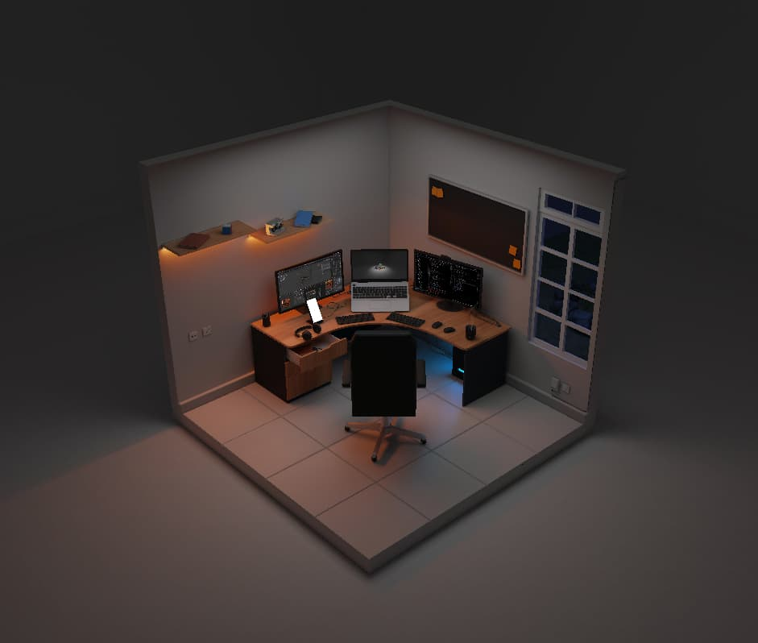

# Nathan Mande's Site

Welcome to the repository of my personal website! 🚀



Here, I'm showcasing my current room, almost exactly as it is. I must admit, I'm not one for loads of details in my workspace 😅.

I'm planning to improve some parts over time, and I'd love to hear your thoughts. Any feedback from you will be welcome!

Please take a moment to explore the [credit section](./src/content/notes/credits.md) for more details about the resources used in this project.

## Open-source

Despite being a personal space, I've chosen to keep my website open-source. Feel free to reuse any part of it as you see fit 😊.

For those specifically interested in the 3D experience, head over to .`/src/experiences`

## How to start

To start the application locally, ensure you have the latest `NodeJS` version installed. Then, follow these steps:

```shell
# Install dependencies
pnpm install

# To run the local server at localhost:3000
pnpm run dev
```

## Deployment

[](https://app.netlify.com/sites/nathan-mande/deploys)

## Known issues

- **Iframe freeze**: On some devices, the contact page may cause the app to freeze when loading the content of the iframe for the first time.
- **Link not active**: When using a `.md` file and clicking on a link, it fails to activate a `NuxtLink`.
